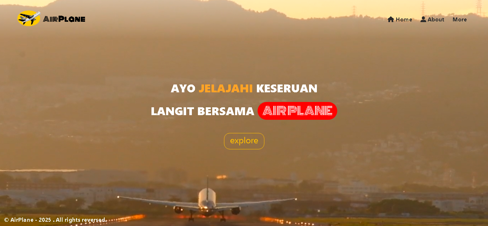

# 💡 Judul Projek
- Web Air Plane

## 🚀 Tujuan Projek
``` markdown
* Menyelesaikan tugas final pemrograman web semester 3
* dosen : Yuliana S.Pd., M.Pd 

### 📸 Preview


## ✔️ Fitur Utama
- Pesan tiket pesawat

## 🔧 Instalasi
1. Clone respository:
    ``` bash
    git clone https://github.com/ahmadadptr001/airplane.git
